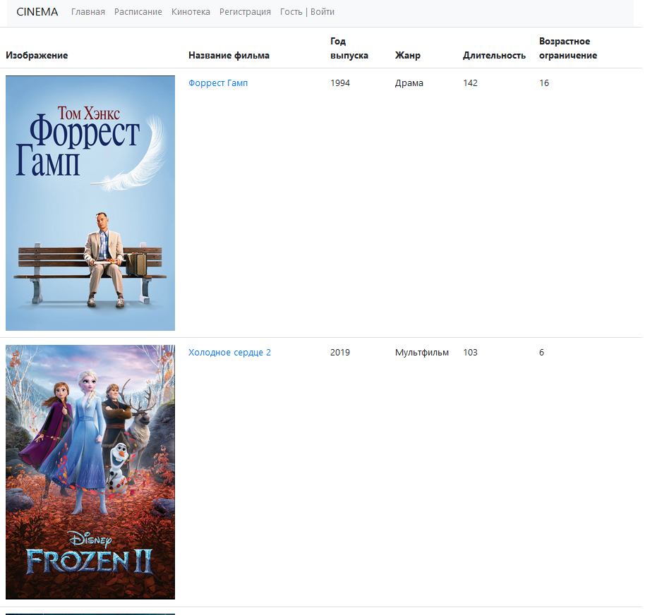
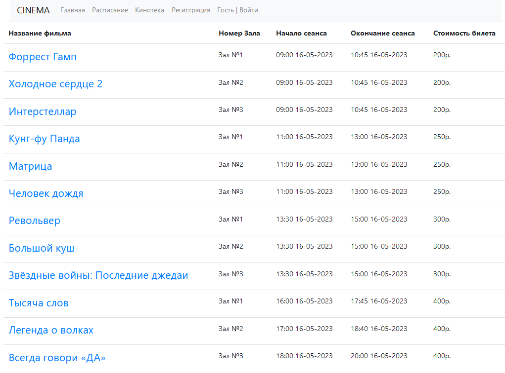
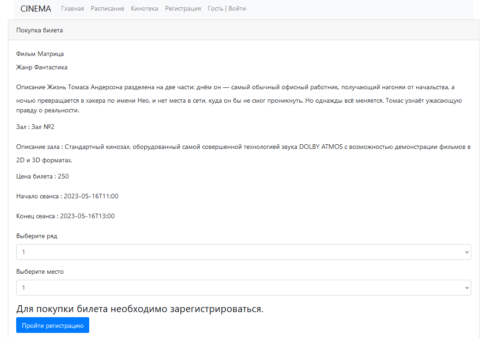

# job4j_cinema

## *Кинотеатр*

### *Описание*
Это сайт по покупке билетов в кинотеатр.
Необходимо выбрать сеанс с фильмом, ряд и место.
Пользователь должен быть зарегистрирован, что бы купить билет.
Авторизация происходит по проверке пары email-пароль.
Используется Spring boot.

### *Стек технологий*
1. Java 17
2. Spring boot 2.5.2
3. Thymeleaf 2.5.2
4. Bootstrap 4.4.1
5. Sql2o 1.6.0
6. PostgreSql 14.1
7. Lombok 1.18.26
8. Liquibase 3.6.2
9. Maven 4.0
10. Log4j 1.2.17
11. AssertJ 3.23.1
12. Mockito 4.0.0
13. H2 1.4

### *Требование к окружению*
Java 17, Maven 4.0, PostgreSQL 14

### *Запуск приложения*
    Запуск с помощью командной строки:
    1.Перейти в папку с проектом.
    2.Выполнить команду: mvn liquibase:update
    3.Выполнить команду: mvn clean install
    4.Выполнить команду: mvn spring-boot:run
    5.Перейти по ссылке: http://localhost:8080/index 

### *Список всех фильмов*

### *Список сеансов*

### *Покупка билета*

## Контакты
При возникновении вопросов, замечаний или предложений, прошу писать мне по указанным ниже контактам:

&nbsp;&nbsp;
&nbsp;&nbsp;

